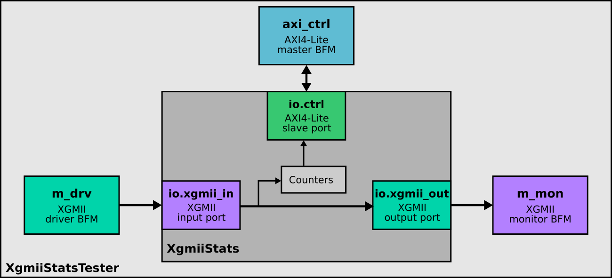

# Examples for BFM tester

Presented in this repository are several examples based on [BFM
tester](https://github.com/j-marjanovic/chisel-bfm-tester), a highly-flexible
way to write tests for Chisel HDL.

## Example 1: AXI-Stream and AXI4-Lite

As a "Hello World"-style example, a module with 2 AXI-Stream input ports, 2
AXI-Stream output ports and an AXI4-Lite control port is instantiated and
tested.

## Example 2: XGMII statistics module

BfmTester also allows the integration of custom (i.e. provided by the user
of the tester) bus functional models. This example provides driver and monitor
for a 10 gigabit media-independent interface (XGMII).

## Example 3: Feedthrough

This example connects directly AXI-Stream Master to an AXI-Stream Slave with
direction connection.

**This example is not working correctly** - the same test passes and fails
for different seeds. The purpose of this example is to demonstrate the current
limitation of the BFM tester.
